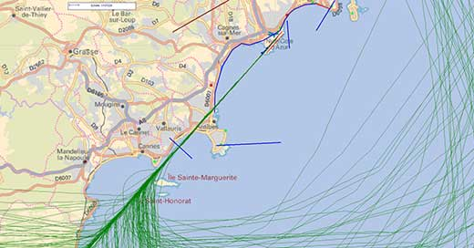
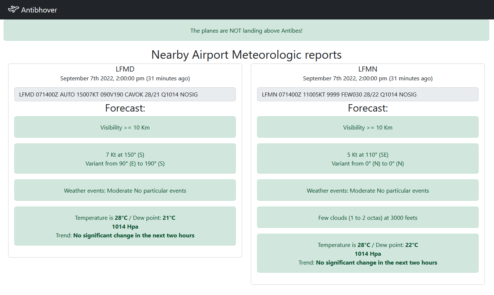

# Antibhover



The city of Antibes (France) is hovered by planes in certain meteorological conditions. The noise this hovering causes is painful for the residents. I built this application to check why planes are passing above, and when it should stop.



## Getting started

This app uses https://avwx.rest/ API, which requires a secret TOKEN
Open ```config.json``` and provide your own TOKEN in ```metar.apiKey``` field.

When done, simply run the app

    npm start